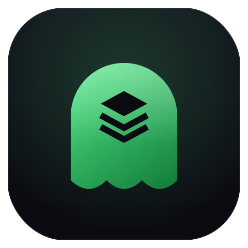

<p align="center">
  
</p>

<h1 align="center">ghostsbom</h1>

A software supply-chain security analyzer. ghostsbom generates a CycloneDX SBOM
from your project's dependency manifests, scans those dependencies for known
vulnerabilities through the OSV.dev API, and layers on supply-chain risk signals
such as typosquatting detection and explainable package-risk heuristics.

It is built for CI gating: one command produces a machine-readable report and a
non-zero exit code when findings cross a severity threshold you choose.

## Features

- CycloneDX 1.5 SBOM generation with package URLs (for example
  `pkg:pypi/requests@2.0.0`, `pkg:npm/lodash@4.0.0`).
- Pluggable parsers, auto-detected by filename:
  - Python `requirements.txt`
  - Poetry `poetry.lock` and `pyproject.toml`
  - npm `package-lock.json` (lockfile versions 1, 2, and 3)
- Vulnerability scanning via the OSV.dev batch API, with severity from CVSS
  where available, a one-line summary, and the versions that contain the fix.
- Supply-chain risk signals:
  - Typosquatting: Damerau-Levenshtein distance against a bundled list of
    popular packages per ecosystem; near-misses (distance 1 to 2) are flagged,
    exact matches are not.
  - Heuristics: immature `0.0.x` versions, pre-release pins, and an injectable
    missing-from-registry check. Every signal carries a plain-language reason.
- An `--offline` mode and a fully dependency-injected HTTP client, so runs and
  tests can avoid the network entirely.
- Rich console summary, full JSON report, and a `--fail-on` exit-code gate.

## Install

Requires Python 3.11 or newer.

```
git clone https://github.com/joemunene-by/ghostsbom.git
cd ghostsbom
python -m venv .venv
source .venv/bin/activate
pip install -e ".[dev]"
```

This installs the `ghostsbom` console command.

## Quickstart

Generate an SBOM from a manifest:

```
ghostsbom sbom requirements.txt -o sbom.json
```

```
{
  "bomFormat": "CycloneDX",
  "specVersion": "1.5",
  "components": [
    { "type": "library", "name": "requests", "version": "2.19.1",
      "purl": "pkg:pypi/requests@2.19.1", "bom-ref": "pkg:pypi/requests@2.19.1" }
  ]
}
```

Scan dependencies (SBOM plus OSV vulnerabilities plus risk signals):

```
ghostsbom scan requirements.txt
```

```
ghostsbom 0.1.0  components=6  vulns=1  risks=1  offline=no
Vulnerabilities
  HIGH   urllib3@1.24.1   GHSA-x84v-xcm2-53pg   Fixed in 1.24.2   Authorization header leak on redirect
Risk signals
  HIGH   typosquat   reqeusts@2.19.1   name 'reqeusts' is within edit distance 1 of popular package 'requests'
Highest severity: HIGH
```

Run a full audit and write the complete JSON report:

```
ghostsbom audit requirements.txt -o report.json
```

The report contains the SBOM, the resolved components, every vulnerability, and
every risk signal, plus a summary block with the maximum severity.

## Supported ecosystems

| Ecosystem | Manifests                                   | purl type |
| --------- | ------------------------------------------- | --------- |
| PyPI      | `requirements.txt`, `poetry.lock`, `pyproject.toml` | `pkg:pypi`  |
| npm       | `package-lock.json`, `npm-shrinkwrap.json`  | `pkg:npm`   |

Parsers are pluggable: each declares the filename patterns it recognises and the
ecosystem it produces, so adding a new ecosystem is a self-contained module.

## OSV and offline notes

`scan` and `audit` query the OSV.dev batch endpoint
(`https://api.osv.dev/v1/querybatch`) and then fetch full records from
`https://api.osv.dev/v1/vulns/{id}`. The HTTP client uses timeouts and retries
and degrades gracefully if the API is unreachable.

Pass `--offline` to skip all network calls. In offline mode no OSV lookups are
performed, but SBOM generation and the offline risk signals (typosquat and
version heuristics) still run. The HTTP client is dependency-injected, which is
how the test suite stays fully offline.

## CI gating with --fail-on

`--fail-on` makes ghostsbom return a non-zero exit code when the highest finding
(vulnerability or risk signal) reaches a threshold. Valid values, lowest to
highest: `none`, `low`, `medium`, `high`, `critical`. The default is `none`,
which never fails the run.

```
ghostsbom scan requirements.txt --fail-on high
```

Exit codes:

- `0`: success, no threshold breached.
- `1`: a finding met or exceeded the `--fail-on` threshold.
- `2`: usage error (missing manifest, unknown manifest type, bad option).
- `3`: the OSV scan failed after retries (use `--offline` to bypass).

Example GitHub Actions step:

```yaml
- name: Supply-chain scan
  run: ghostsbom scan requirements.txt --fail-on high
```

## Architecture

```
src/ghostsbom/
  models.py        Component, Vulnerability, RiskSignal, Severity, purl mapping
  parsers/         pluggable, filename-detected manifest parsers
    base.py        Parser protocol
    requirements.py
    poetry.py
    npm_lock.py
  sbom.py          CycloneDX 1.5 document builder
  osv.py           OSV client protocol, HTTP client (retries), offline client
  scanner.py       maps OSV records onto components, severity derivation
  risk.py          Damerau-Levenshtein typosquat detection plus heuristics
  report.py        report assembly and rich rendering
  cli.py           Typer CLI: sbom, scan, audit, version
  data/            bundled popular-package lists per ecosystem
```

The data flow is: parsers produce `Component` objects, `sbom.build_sbom` turns
them into a CycloneDX document, `scanner.scan_components` enriches them with OSV
findings through an injected client, and `risk.assess_risk` adds non-CVE
signals. `report.Report` ties it together for JSON output and console rendering.

## Development

```
ruff check .
pytest
```

The test suite mocks all network access, so it passes with no connectivity.

## Roadmap

- Additional ecosystems: Go modules, Cargo, RubyGems, Maven.
- VEX output and suppression files for known-not-affected findings.
- Live PyPI and npm registry checks behind the injected client for the
  missing-from-registry heuristic.
- SPDX output alongside CycloneDX.
- Dependency-graph depth and transitive-path reporting.

## License

MIT. See [LICENSE](LICENSE).
